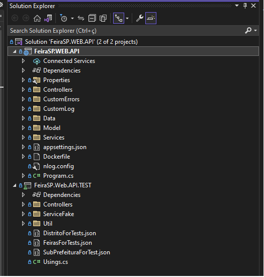
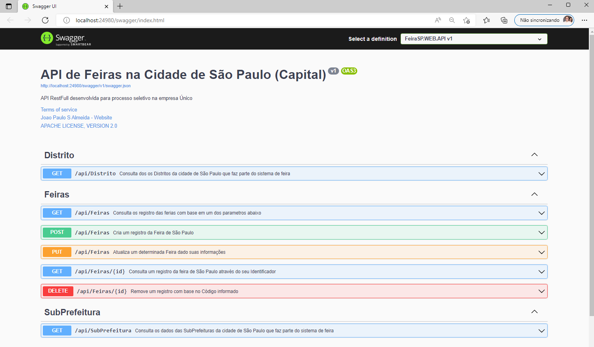
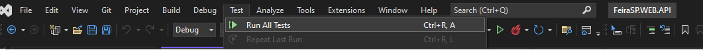
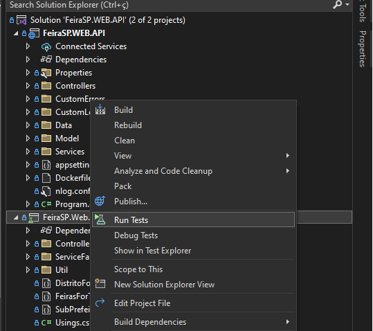
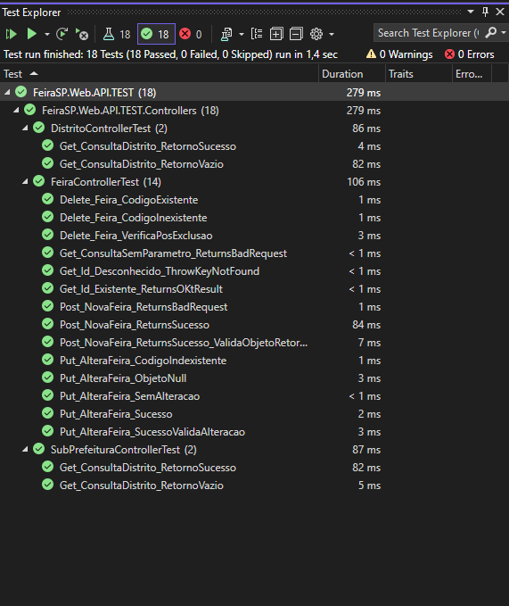

## API RestFull para processo seletivo da Único
API para operação CRUD de dados da Feira de São Paulo (Capital) 
Desenvolvida em ASP .NET Core versão 6 utilizando o Visual Studio 2022 Community e banco de dados Relacional SQL Server Express (Todos versões gratuitas)
No desenvolvimento foram utilizados EntityFramewerk 6.0 para persistência e consutal dos dados e o XUnit .NET para testes unitários.
Para servidor do SQL Server foi utilizado uma imagem Docker da propria Microsoft.
O projeto está estruturas da seguinte forma:
```bash
├── PROJETO\
│   ├── FeiraSP.WEB.API\ 
│   └── FeiraSP.Web.API.TEST \
│   └── FeiraSP.WEB.API.sln
├── SCRIPTS\
│   └── 01 - CREATE DATABASE.sql
│   └── 02 - CREATE SCHEMA.sql
│   └── 03 - INSERT DISTRITOS.sql
│   └── 04 - INSERT TB_SUB_PREFEITURA.sql
│   └── 05 - INSERT TB_FEIRA.sql
│   └── 99 - ROLLBACK.sql
```

# Pasta Projeto
Nessa pasta contém todos os fontes para execução da aplicação, bem como o projeto de teste unutáro. 
Os projetos .NET possui uma ferramenta integrada que é possível acessar todos os arquivos em um único lugar. 
Para abrir o projeto, basta acessar o Arquivo de Soluções (.sln) localizado em PROJETO\FeiraSP.WEB.API.sln

# Pasta SCRIPTS
Nessa pasta todos os arquivos necessários para criar e popular a base de dados para rodar o projeto. Para ter sucesso na instalação, é necessário seguir a ordem numérica:
* 01 - Cria a base de dados com o nome `DB_FEIRA_LIVRE`
* 02 - Cria três tabelas responsável pelo armazenamento das informações: 
  1. _TB_DISTRITO_ - Informações do Distrito da feira.
  2. _TB_SUB_PREFEITURA_ - Informações da SubPrefeitura onde onde a feira acontece.
  3. _TB_FEIRA_ - Todas as informações referente a feira de rua.
* 03 - Realiza a Carga dos dados referente a tabela de Distritos
* 04 - Realiza a Carga dos dados referente a tabela da SubPrefeitura
* 05 - Realiza a Carga dos dados referente a tabela de Feira
* 09 - Esse script só deverá ser executado em caso de falha ou desistalação da aplicação. Ele remove a base de dados do servidor SQL


# Configuração

<h4>Caso não tenha servidor de SQL Server, seguir os passos abaixo:</h4>

01 - Efeturar a Instalação do Docker através da página oficial  https://www.docker.com/products/docker-desktop/

02 - Criar um novo container através do comando: `docker run -e "ACCEPT_EULA=Y" -e "SA_PASSWORD=t3st3Un1c0" -e "MSSQL_PID=Express" -p 1439:1433 -d --name=sql mcr.microsoft.com/mssql/server:latest`

Esse comando cria um _container_ Sql Server disponilizando um servidor com usuário `sa` e senha `t3st3Un1c0` rodando na porta `1439`

<h4>Caso já tenha servidor de SQL Server, seguir os passos abaixo:</h4>

01 - Alterar as propriedades abaixo do arquivo de config da API localizado em: `/Projeto/FeiraSP.WEB.API/FeiraSP.WEB.API/appsettings.json`
*   Data Source _Nome ou IP do Servidor do seu banco de dados_
*   User ID: _Usuário do seu banco de dados_
*   Password: _Senha do usuário do seu banco de dados_

# Rodando o projeto

Após aberto o arquivo PROJETO\FeiraSP.WEB.API.sln será exibido a janela <b>Soluction Explorer</b> abaixo  com os dois projetos.

Em seguida, basta ir no Menu "Debug -> Start Debbuning" ou simplesmente pressinar a tecla F5.




Na sequência, será aberto o Navegador com a página incial do `Swagger` como mostrado abaixo:



# Executando a API


O projeto está com as configurações e documentações suportadas pelo Swagger, nele é possível consultar todos os métodos disponíveis, bem os parametros de entrada, saida e possíveis erros, além de poder executar as chamadas, sem necessidade de uma ferramenta adicional (try it out).

Abaixo uma descrição dos serviços:

*   <h4>Distrito</h4>
    Essa API possui apenas o método _GET_ que é responsável por exibir todos os distritros onde as ferias são registadas
*   <h4>Feiras</h4>
    Essa API possui cinco métodos, cada um com seu objetivo especifico:

    <h5>GET  /api/ferias</h5> 
    Esse método recebe quatro parametros, sendo eles apenas um obrigatório. É realizado a busca pelas ferias através de um dos campos abaixo:
    
        * Código do Distrito
        * Nome da Região 5
        * Nome da Feira
        * Bairro da Feira
    <h5>GET /api/ferias/{id}</h5> 
    Esse método realiza a busca pela feira com base em seu Código.

    <h5>POST /api/ferias/</h5>
    Esse método realiza o cadastro de uma feira com todas as informações através de um objeto DTO.

    <h5>PUT /api/feria</h5>
    Esse método realiza a alteração dos dados de uma feria através de um objeto DTO.

    <h5>DELETE /api/ferias/{id}</h5>
    Esse método realiza a exclusão de uma feria com base em seu código.


   <h4>SubPrefeitura</h4>
      Essa API possui apenas o método _GET_ que é responsável por exibir toda as SubPrefeitura onde as feiras são registradas.


# Executando Testes Automatizados

Para executar os testes da API, é possível fazer de duas maneiras:

1º - Ir no meu "Test -> Run All Tests" como mostrado abaixo:


2º - Clicar com o botão direito no projeto `FeiraSP.Web.API.TEST` e selecionar `Run Tests` 



O resultado dos testes será apresentado na janela "Test Explorer" que pode ser acessada atráves do menu "View -> Test Explorer"




# Referências

Configuração Swagger: https://code-maze.com/swagger-ui-asp-net-core-web-api/
Testes Unitários com XUnit: https://code-maze.com/unit-testing-aspnetcore-web-api/


